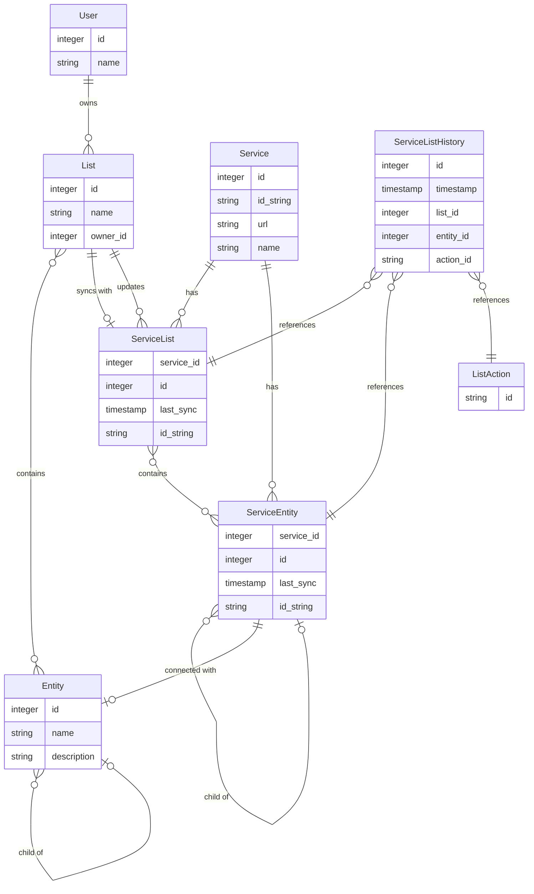

```mermaid
erDiagram
	User ||--o{ List : owns
	List }o--o{ Entity: contains
	Entity }o--o| Entity : "child of"
	Service ||--o{ ServiceList : has
	Service ||--o{ ServiceEntity : has
	ServiceList }o--o{ ServiceEntity : contains
	ServiceEntity }o--o| ServiceEntity : "child of"
	List ||--o| ServiceList : "syncs with"
	List ||--o{ ServiceList : "updates"
	ServiceEntity ||--o| Entity : "connected with"
	ServiceListHistory }o--|| ServiceList : references
	ServiceListHistory }o--|| ServiceEntity : references
	ServiceListHistory }o--|| ListAction : references

	Entity {
		integer id
		string name
		string description
	}

	List {
		integer id
		string name
		integer owner_id
	}

	User {
		integer id
		string name
	}

	Service {
		integer id
		string id_string
		string url
		string name
	}

	ServiceList {
		integer service_id
		integer id
		timestamp last_sync
		string id_string
	}

	ServiceEntity {
		integer service_id
		integer id
		timestamp last_sync
		string id_string
	}

	ServiceListHistory {
		integer id
		timestamp timestamp
		integer list_id
		integer entity_id
		string action_id
	}

	ListAction {
		string id
	}
```