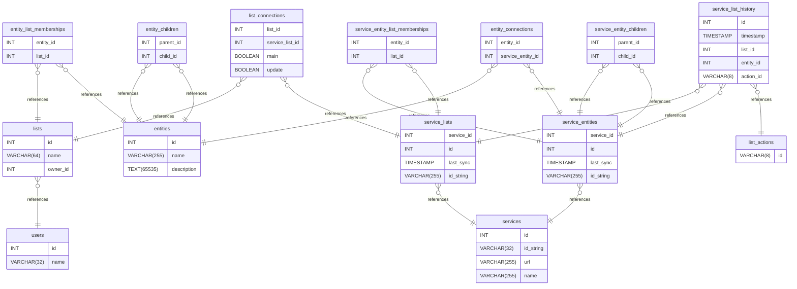

```mermaid
erDiagram
	lists }o--|| users : references
	entity_list_memberships }o--|| lists : references
	entity_list_memberships }o--|| entities : references
	entity_children }o--|| entities : references
	entity_children }o--|| entities : references
	service_lists }o--|| services : references
	service_entities }o--|| services : references
	service_entity_list_memberships }o--|| service_entities : references
	service_entity_list_memberships }o--|| service_lists : references
	service_entity_children }o--|| service_entities : references
	service_entity_children }o--|| service_entities : references
	list_connections }o--|| lists : references
	list_connections }o--|| service_lists : references
	entity_connections }o--|| entities : references
	entity_connections }o--|| service_entities : references
	service_list_history }o--|| service_lists : references
	service_list_history }o--|| service_entities : references
	service_list_history }o--|| list_actions : references

	entities {
		INT id
		VARCHAR(255) name
		TEXT(65535) description
	}

	lists {
		INT id
		VARCHAR(64) name
		INT owner_id
	}

	entity_list_memberships {
		INT entity_id
		INT list_id
	}

	entity_children {
		INT parent_id
		INT child_id
	}

	users {
		INT id
		VARCHAR(32) name
	}

	services {
		INT id
		VARCHAR(32) id_string
		VARCHAR(255) url
		VARCHAR(255) name
	}

	service_lists {
		INT service_id
		INT id
		TIMESTAMP last_sync
		VARCHAR(255) id_string
	}

	service_entities {
		INT service_id
		INT id
		TIMESTAMP last_sync
		VARCHAR(255) id_string
	}

	service_entity_list_memberships {
		INT entity_id
		INT list_id
	}

	service_entity_children {
		INT parent_id
		INT child_id
	}

	list_connections {
		INT list_id
		INT service_list_id
		BOOLEAN main
		BOOLEAN update
	}

	entity_connections {
		INT entity_id
		INT service_entity_id
	}

	service_list_history {
		INT id
		TIMESTAMP timestamp
		INT list_id
		INT entity_id
		VARCHAR(8) action_id
	}

	list_actions {
		VARCHAR(8) id
	}
```